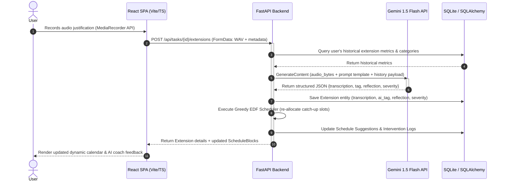

# 🌊 Drift — AI-Driven Deadline Accountability & Behavioral Analytics Suite

[](https://fastapi.tiangolo.com/)
[](https://react.dev/)
[](https://www.typescriptlang.org/)
[](https://ai.google.dev/)
[](https://sqlite.org/)
[](https://jwt.io/)

**Drift** is a professional-grade, full-stack productivity engineering suite designed to counteract the **Planning Fallacy** by capturing, logging, and analyzing the behavioral and operational friction points behind task deadline extensions. 

Unlike traditional task managers that enable silent schedule slippage, Drift introduces cognitive friction: every deadline extension requires a multimodal (voice or text) justification. The platform utilizes advanced AI analysis to map delay root causes against historical patterns, recalculates task risk scores in real-time, and dynamically generates catch-up work sessions using a deterministic scheduling algorithm.

---

## 🧠 System Architecture & Data Flow

The following sequence diagram illustrates the lifecycle of a deadline extension request, from browser audio capture to structured AI reflection, culminating in the recalculation of the user's recovery schedule.



---

## 🛠️ Core Engineering & Algorithmic Implementations

### 1. Real-Time Risk Prevention Engine (Heuristic Probability Model)
The Drift Risk Engine calculates a **Drift Probability Score (0–100%)** sub-500ms as the user types task metadata. The engine uses a deterministic heuristic weighting model:

$$\text{Drift Score} = (0.40 \cdot R_{category}) + (0.20 \cdot R_{global}) + (0.20 \cdot R_{keyword}) + (0.20 \cdot F_{tightness})$$

Where:
* **Category Rate ($R_{category}$)**: The ratio of tasks extended in this category.
* **Global Rate ($R_{global}$)**: The user's total task extension ratio.
* **Keyword Matching Rate ($R_{keyword}$)**: Analysis of task title tokens (length $\ge 3$) against historically extended tasks containing the same keywords.
* **Deadline Tightness ($F_{tightness}$)**: A non-linear scale factor comparing the requested task duration against the historical completion average:
  $$F_{tightness} = \begin{cases} 
    0.5 + 0.5 \cdot \left(1 - \frac{D_{given}}{D_{avg}}\right) & \text{if } D_{given} < D_{avg} \\
    0.5 \cdot \left(\frac{D_{avg}}{D_{given}}\right) & \text{if } D_{given} \ge D_{avg} 
  \end{cases}$$

### 2. Multimodal AI Handoff & Cognitive Coaching
When requesting an extension, the user must record a justification via the browser's **MediaRecorder API**.
* **Audio Pipeline**: Raw WAV files are sent directly to the FastAPI server, which streams them alongside the user's historical summary using the **Google GenAI SDK** to the Gemini 1.5 Flash API.
* **Structured Response Schema**: The model returns a typed JSON payload classifying the blocker into root causes (`Technical Blocker`, `Underestimated Effort`, `External Dependency`, `Scope Creep`, `Personal`), outputting a constructive behavioral coaching advice based on historical tendencies, and assigning a severity rating (1–3).

### 3. Dynamic Recovery Planner (Greedy Earliest-Deadline-First Scheduler)
To enforce scheduling accountability, Drift dynamically books **Rescue Blocks** to compensate for delays.
* **Time Penalty Formula**: Every 1 day of deadline extension triggers **2 hours** of locked, focused catch-up work.
* **EDF Algorithm**:
  - Retrieves active tasks, sorting them by `current_deadline` ascending.
  - Loops chronologically beginning on the next calendar day (skipping weekends).
  - Allocates 2-hour blocks within standard business hours (9:00 AM – 6:00 PM), skipping lunch (1:00 PM – 2:00 PM).
  - Resolves overlaps by prioritizing tasks with closer deadlines and wrapping lower-priority tasks chronologically.

### 4. Proactive Intervention Engine
A backend evaluation job monitors task health on page load and generates dismissible sliding banners for three distinct triggers:
* **Checklist Stagnation**: Task is due within 48 hours and has `0` completed checklist items.
* **High-Risk Profiles**: Task has a computed Drift Score $> 70\%$ and is due within 7 days.
* **Frequent Delays**: Task has been extended $\ge 3$ times.

---

## 🗄️ Database Architecture

The schema is built using SQLAlchemy models mapped to a local SQLite database (for development) or PostgreSQL (for production).

| Table | Attribute | Type | Constraints | Description |
| :--- | :--- | :--- | :--- | :--- |
| **users** | `id` | Integer | PK, Index | Unique user identifier |
| | `email` | String | Unique, Index, Not Null | Account email |
| | `password_hash` | String | Not Null | Bcrypt hashed password |
| | `name` | String | Not Null | User profile name |
| | `created_at` | DateTime | Default UTC Now | Signup timestamp |
| **tasks** | `id` | Integer | PK, Index | Unique task identifier |
| | `user_id` | Integer | FK -> `users.id`, Cascade | Owner ID |
| | `title` | String | Not Null | Task title |
| | `description` | Text | Nullable | Task description & checklist |
| | `category` | String | Not Null | e.g., Development, Design |
| | `original_deadline` | DateTime | Not Null | Initial deadline timestamp |
| | `current_deadline` | DateTime | Not Null | Current shifted deadline |
| | `status` | String | Default 'active' | active, completed, overdue |
| | `drift_score` | Integer | Default 50 | Calculated risk % (0-100) |
| | `drift_explanation`| Text | Nullable | Detail explanation of risk score |
| **extensions** | `id` | Integer | PK, Index | Unique extension identifier |
| | `task_id` | Integer | FK -> `tasks.id`, Cascade | Mapped task ID |
| | `extended_by_days`| Integer | Not Null | Extended duration |
| | `raw_reason` | Text | Nullable | Typed reason text |
| | `raw_transcription`| Text | Nullable | Audio transcribed text |
| | `ai_tag` | String | Nullable | Classified tag from Gemini |
| | `ai_reflection` | Text | Nullable | AI coaching feedback |
| | `severity` | Integer | Nullable (1-3) | Impact level |
| | `input_method` | String | Not Null | voice or text |
| | `timestamp` | DateTime | Default UTC Now | Extension request timestamp |
| **schedule_suggestions** | `id` | Integer | PK, Index | Unique identifier |
| | `task_id` | Integer | FK -> `tasks.id`, Cascade | Mapped task ID |
| | `suggested_blocks`| JSON | Not Null | Structured array of `{start, end, label}` |
| | `generated_at` | DateTime | Default UTC Now | Recalculation timestamp |
| **intervention_logs** | `id` | Integer | PK, Index | Unique identifier |
| | `user_id` | Integer | FK -> `users.id`, Cascade | Owner ID |
| | `task_id` | Integer | FK -> `tasks.id`, Nullable | Mapped task ID |
| | `intervention_type`| String | Not Null | zero_subtasks, high_drift, many_extensions |
| | `message` | Text | Not Null | Banner display text |
| | `dismissed` | Boolean | Default False | Banner status |

---

## 📡 REST API Specifications

### Authentication
* `POST /api/auth/register` — Standard registration. Payload: `{ email, password, name }`
* `POST /api/auth/login` — Authentication endpoint. Payload: `{ email, password }` -> Returns `{ access_token, token_type }`
* `GET /api/auth/me` — Fetches current user profile from JWT payload in headers.

### Task Management
* `GET /api/tasks` — Lists user's active/completed tasks.
* `POST /api/tasks` — Creates new task and triggers risk calculation. Payload: `{ title, description, category, current_deadline }`
* `GET /api/tasks/{id}` — Fetches detailed task info with historical timeline and scheduled blocks.
* `PUT /api/tasks/{id}` — Updates task details or marks as completed.
* `DELETE /api/tasks/{id}` — Deletes task.
* `POST /api/tasks/preview-drift` — Debounced pre-submit risk preview. Payload: `{ title, category, deadline }`

### Extensions & Scheduling
* `POST /api/tasks/{id}/extensions` — Logs a deadline shift. Multi-part form-data: audio blob (optional), text reason (optional), `extended_by_days`, `input_method`. Triggers Gemini analysis and schedules rescue blocks.
* `GET /api/schedule` — Returns active rescue schedule blocks.
* `POST /api/schedule/regenerate` — Manually triggers greedy EDF rescheduling.
* `GET /api/interventions` — Fetches active warning logs.
* `POST /api/interventions/{id}/dismiss` — Dismisses alert banner.
* `GET /api/insights` — Compiles category ratios, severity distribution, delay timelines, and the "Hall of Fame".

---

## ⚙️ Setup and Installation

### Prerequisites
* **Node.js (v18+)** and npm.
* **Python 3.8+** (Virtual environment configured).
* A **Google Gemini API Key** (from [Google AI Studio](https://aistudio.google.com/)).

### 1. Backend Configuration
1. Navigate to the backend directory:
   ```bash
   cd drift-backend
   ```
2. Create and activate your python virtual environment:
   ```bash
   python -m venv venv
   # Windows:
   .\venv\Scripts\activate
   # macOS/Linux:
   source venv/bin/activate
   ```
3. Install Python dependencies:
   ```bash
   pip install -r requirements.txt
   ```
4. Configure environment parameters:
   Create a `.env` file (copied from `.env.example`) and insert your API credentials:
   ```env
   DATABASE_URL=sqlite:///./drift.db
   JWT_SECRET_KEY=generate_your_secure_random_key_here
   JWT_ALGORITHM=HS256
   ACCESS_TOKEN_EXPIRE_MINUTES=1440
   GEMINI_API_KEY=your_google_gemini_api_key
   ```
5. Run backend unit tests:
   ```bash
   python -m pytest tests/
   ```
6. Start the development API server:
   ```bash
   python -m uvicorn app.main:app --reload --port 8000
   ```
   Interactive Swagger documentation is available at `http://127.0.0.1:8000/docs`.

### 2. Frontend Configuration
1. Open a new terminal and navigate to the frontend directory:
   ```bash
   cd drift-frontend
   ```
2. Install npm packages:
   ```bash
   npm install
   ```
3. Run the client development server:
   ```bash
   npm run dev
   ```
4. Access the web dashboard at `http://localhost:5173`.

### 3. Containerized Development (Docker & PostgreSQL)
Drift supports a fully containerized local development environment utilizing Docker Compose to coordinate the API server, a PostgreSQL database, and pgAdmin.

1. Ensure **Docker Desktop** is installed and running on your host system.
2. In the `drift-backend` directory, build and launch the container suite:
   ```bash
   docker compose up --build
   ```
3. Once running, the infrastructure exposes:
   * **FastAPI Server**: `http://localhost:8000` (Healthcheck endpoint: `/health`)
   * **Interactive API Docs (Swagger)**: `http://localhost:8000/docs`
   * **PostgreSQL Database**: Port `5432` on `localhost` (Credentials: User: `drift`, Password: `drift`, DB: `drift`)
   * **pgAdmin Console**: `http://localhost:5050`
     - **Login Email**: `admin@drift.local`
     - **Login Password**: `admin`
     - **Connection Server Host**: `db` (internal Docker hostname)

*Note: The FastAPI container mounts the local backend source directory (`./:/app`), enabling instant hot-reloads inside Docker whenever you make modifications to local code files.*

---

## 🔮 Production Roadmap

* **Google & Outlook Calendar Sync**: Implement bidirectional syncing to dynamically write recovery blocks into standard workspace calendar schedules.
* **Team-Level Friction Coaching**: Aggregate analytics across teams to identify organizational bottleneck dependencies (e.g., specific vendor delay rates) and automatically adjust downstream Gantt schedules.
* **Adaptive Scoring System**: Transition the current heuristic risk model into a reinforcement learning framework that adapts coefficients based on individual user completion trends.
