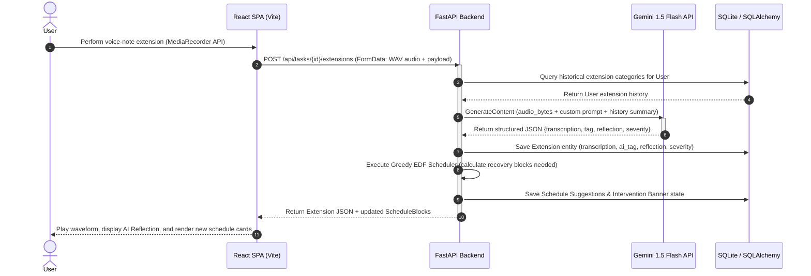

# 🌊 Drift 2.0 — Turn Deadline Extensions Into Behavioral Insights

**Drift** is a premium, full-stack, AI-driven productivity suite engineered to resolve the **Planning Fallacy** by capturing the psychological and operational friction points behind task deadline extensions. 

Unlike traditional task managers that allow users to silently push deadlines out of sight, Drift logs, tags, and analyzes every single schedule adjustment. By converting extensions into behavioral data, Drift calculates task risk factors dynamically, delivers real-time voice coaching via Gemini 1.5 Flash, and automatically constructs custom Earliest-Deadline-First weekday calendar recovery blocks.

---

## 🧠 The Planning Fallacy & Drift's Core Vision

In cognitive psychology, the **Planning Fallacy** (originally proposed by Daniel Kahneman and Amos Tversky) is a phenomenon where predictions about how much time will be needed to complete a future task display an optimistic bias and underestimate the time needed.

Standard calendar tools and task trackers are **enablers of the Planning Fallacy**:
1. **Silent Extensions**: Moving a task from Tuesday to Friday has zero visual or behavioral penalty.
2. **Loss of History**: The original plan is overwritten and forgotten.
3. **No Retrospective Analysis**: Users run into the exact same issues (e.g. library bugs, client delays) repeatedly without realizing the pattern.

**Drift** introduces a behavioral barrier to delay:
* Every time a deadline shifts, you must supply the context (text or voice-first description).
* An AI coach categorizes the root cause, rates the severity, and cross-references your history.
* The system schedules a mandatory calendar recovery block to ensure you actively pay for the extension in time.

---

## 🛠️ System Architecture

The following diagram illustrates the flow of a deadline extension inside the Drift system, leveraging the **FastAPI** backend, the **SQLite** database, and the **Gemini 1.5 Flash API** for audio processing.



---

## 🚀 Core Algorithmic & AI Engines

Drift implements four core algorithmic services designed for maximum technical elegance and whiteboard-level logic clarity.

### 1. Drift Risk Engine (Heuristic Probability Model)
The Drift Risk Engine calculates a **Drift Probability Score (0–100%)** live in 500ms as the user types task details in the form. It uses a deterministic heuristic weighting model:

$$\text{Drift Score} = (0.40 \cdot R_{category}) + (0.20 \cdot R_{global}) + (0.20 \cdot R_{keyword}) + (0.20 \cdot F_{tightness})$$

Where:
* **Category Rate ($R_{category}$)**: The ratio of tasks extended in this category.
* **Global Rate ($R_{global}$)**: The user's total task extension ratio.
* **Keyword Matching Rate ($R_{keyword}$)**: Analysis of task title tokens (length $\ge 3$) against historically extended tasks containing the same keywords.
* **Deadline Tightness ($F_{tightness}$)**: A non-linear scale factor comparing the requested task duration against the historical completion average:
  $$F_{tightness} = \begin{cases} 
    0.5 + 0.5 \cdot \left(1 - \frac{D_{given}}{D_{avg}}\right) & \text{if } D_{given} < D_{avg} \\
    0.5 \cdot \left(\frac{D_{avg}}{D_{given}}\right) & \text{if } D_{given} \ge D_{avg} 
  \end{cases}$$

### 2. Smart Extension Coach with Voice Input
When a user requests a deadline extension, they must provide a justification. Drift supports a **multimodal voice pipeline**:
* Captured via the browser **MediaRecorder API** with active CSS canvas waveforms.
* Audio payload (WAV) is sent directly to FastAPI, which forwards the raw bytes and mime-type alongside the user's historical summary to **Gemini 1.5 Flash** using the Google GenAI SDK.
* Gemini performs simultaneous word-for-word transcription and behavioral root-cause analysis, returning structured JSON containing:
  - **AI Tag**: Classified into one of 5 root causes (`Technical Blocker`, `Underestimated Effort`, `External Dependency`, `Scope Creep`, `Personal`).
  - **AI Reflection**: A personalized, constructive suggestion mapping current failure reasons against previous history (e.g. *"This is the 3rd time a library dependency blocked you — plan dedicated spike research next time"*).
  - **Severity Rating**: Scaling from 1 (unavoidable deviation) to 3 (preventable behavioral pattern).

### 3. Calendar Rescue Scheduler (Greedy Earliest-Deadline-First)
To enforce accountability, Drift automatically schedules **Rescue Blocks** to catch up.
* **Time Penalty**: For every 1 day a deadline is extended, Drift schedules **2 hours** of focused work.
* **Algorithm**: A greedy **Earliest-Deadline-First (EDF)** scheduler.
  - Retrieves all active tasks for the user, sorted by `current_deadline` ascending.
  - Beginning on the next calendar day (tomorrow), it loops through tasks and attempts to fit the required 2-hour blocks into open weekday slots (Monday–Friday, 9:00 AM – 6:00 PM).
  - Skips lunch (1:00 PM – 2:00 PM), yielding four clean scheduling slots: `09:00-11:00`, `11:00-13:00`, `14:00-16:00`, and `16:00-18:00`.
  - Higher-priority tasks (earlier deadlines) secure slots first. Lower-priority tasks search chronologically and wrap around existing slots, up to a 60-day threshold.

### 4. Proactive Intervention Alerts
A background analyzer runs on frontend page loads to capture high-risk tasks and alert users:
* **Rule A**: Active tasks due within 48h with `0` checked checklist items in the description.
* **Rule B**: Tasks with a Drift Score $> 70\%$ due within 7 days.
* **Rule C**: Any task that has been extended $\ge 3$ times.
* Banners are rendered as elegant sliding headers that link directly to calendar recovery plans.

---

## 🗄️ Database Architecture & Schema

Drift uses SQLAlchemy to bridge models to SQLite (for local dev) or PostgreSQL.

| Table | Attribute | Type | Constraints | Description |
| :--- | :--- | :--- | :--- | :--- |
| **users** | `id` | Integer | PK, Index | Unique user ID |
| | `email` | String | Unique, Index, Not Null | Account email |
| | `password_hash` | String | Not Null | Bcrypt hashed password |
| | `name` | String | Not Null | User profile name |
| | `created_at` | DateTime | Default UTC Now | Signup date |
| **tasks** | `id` | Integer | PK, Index | Unique task ID |
| | `user_id` | Integer | FK -> `users.id`, Cascade | Owner ID |
| | `title` | String | Not Null | Task title |
| | `description` | Text | Nullable | Task description & checklist |
| | `category` | String | Not Null | e.g. Development, Design |
| | `original_deadline` | DateTime | Not Null | Initial deadline |
| | `current_deadline` | DateTime | Not Null | Shifted deadline |
| | `status` | String | Default 'active' | active, completed, overdue |
| | `drift_score` | Integer | Default 50 | Calculated risk % (0-100) |
| | `drift_explanation`| Text | Nullable | Human readable risk prompt |
| | `created_at` | DateTime | Default UTC Now | Task creation date |
| **extensions** | `id` | Integer | PK, Index | Unique extension ID |
| | `task_id` | Integer | FK -> `tasks.id`, Cascade | Associated task |
| | `extended_by_days`| Integer | Not Null | Duration of push |
| | `raw_reason` | Text | Nullable | Typed reason text |
| | `raw_transcription`| Text | Nullable | Audio transcribed text |
| | `ai_tag` | String | Nullable | Coach classified tag |
| | `ai_reflection` | Text | Nullable | Coach constructive response |
| | `severity` | Integer | Nullable (1-3) | Impact level |
| | `input_method` | String | Not Null | voice or text |
| | `timestamp` | DateTime | Default UTC Now | Push time |
| **schedule_suggestions** | `id` | Integer | PK, Index | Unique suggestion ID |
| | `task_id` | Integer | FK -> `tasks.id`, Cascade | Associated task |
| | `suggested_blocks`| JSON | Not Null | Array of `{start, end, label}` |
| | `generated_at` | DateTime | Default UTC Now | Creation timestamp |
| | `auto_triggered` | Boolean | Default True | Autogenerated by shift |
| **intervention_logs** | `id` | Integer | PK, Index | Unique intervention ID |
| | `user_id` | Integer | FK -> `users.id`, Cascade | User ID |
| | `task_id` | Integer | FK -> `tasks.id`, Nullable | Associated task |
| | `intervention_type`| String | Not Null | zero_subtasks, high_drift, many_extensions |
| | `message` | Text | Not Null | Banner text |
| | `dismissed` | Boolean | Default False | Is banner closed |
| | `created_at` | DateTime | Default UTC Now | Evaluation date |

---

## 📡 REST API Specifications

### Authentication Routes
* `POST /api/auth/register` - Create user. Payload: `{ email, password, name }`
* `POST /api/auth/login` - Authenticate & obtain JWT. Payload: `{ email, password }` -> Returns `{ access_token, token_type }`
* `GET /api/auth/me` - Get profile of authenticated user. Header: `Authorization: Bearer <token>`

### Tasks Routes
* `GET /api/tasks` - List all user tasks.
* `POST /api/tasks` - Create task. Payload: `{ title, description, category, current_deadline }` (Autocalculates Drift Score)
* `GET /api/tasks/{id}` - Fetch detailed task schema with full extension timeline list and schedules.
* `PUT /api/tasks/{id}` - Modify details or complete task.
* `DELETE /api/tasks/{id}` - Remove task.
* `POST /api/tasks/preview-drift` - Preview Drift Score before saving. Payload: `{ title, category, deadline }`

### Extension & Coach Routes
* `POST /api/tasks/{id}/extensions` - Log a new deadline shift. Accepts multipart form-data (audio file `audio` plus form fields `extended_by_days` and `input_method`). Invokes Gemini 1.5 Flash, updates task deadline, and runs scheduler.

### Schedule Suggestions
* `GET /api/schedule` - Fetch current rescue schedule blocks sorted chronologically.
* `POST /api/schedule/regenerate` - Manually trigger EDF schedule recalculation across all active tasks.

### Intervention Banners
* `GET /api/interventions` - Fetch active, undismissed alert messages.
* `POST /api/interventions/{id}/dismiss` - Dismiss specific warning banner.

### Insights Dashboard
* `GET /api/insights` - Returns general metrics (streaks, average drift, common tags), tag distribution count arrays, historical drift line chart points, category-by-category extension rate metrics, and the Drift Hall of Fame.

---

## 📂 Project Directory Structure

```text
DRIFT 2.0/
├── drift-backend/
│   ├── app/
│   │   ├── database.py       # SQLAlchemy engine, session maker & Base schema
│   │   ├── models.py         # Declarative mapping models
│   │   ├── schemas.py        # Pydantic validation schemas
│   │   ├── auth.py           # JWT generation, token verification, password bcrypt
│   │   ├── routers/
│   │   │   ├── tasks.py      # CRUD, live risk engine preview endpoints
│   │   │   ├── extensions.py # Extension logging, Gemini coach execution, schedule trigger
│   │   │   ├── schedule.py   # Schedule blocks retrieval & recalculations
│   │   │   ├── insights.py   # Stats compilers & Hall of Fame list
│   │   │   └── interventions.py # Alert banner fetch and dismiss endpoints
│   │   ├── services/
│   │   │   ├── drift_engine.py  # Heuristic category/keyword/tightness risk model
│   │   │   ├── gemini_service.py# AI multimodal audio transcription & coach reflections
│   │   │   ├── scheduler.py     # Earliest-Deadline-First weekday allocation algorithm
│   │   │   └── intervention_engine.py # Evaluation checks for active tasks
│   │   └── main.py           # FastAPI config, CORS setup, router registrations
│   ├── tests/
│   │   ├── test_services.py  # Unit tests for services (using in-memory db)
│   │   └── test_gemini_service.py # Gemini mock tests
│   ├── requirements.txt      # Backend Python packages
│   └── .env.example          # Template environment parameters
│
└── drift-frontend/
    ├── src/
    │   ├── api/
    │   │   └── client.ts     # Axios instance configured with JWT interceptors
    │   ├── types/
    │   │   └── index.ts      # TypeScript interfaces mirroring API schema shapes
    │   ├── hooks/
    │   │   ├── useDriftScore.ts # Form custom hook supporting debounce live calculations
    │   │   └── useIntervention.ts # Active alert hook for marquee alerts
    │   ├── components/
    │   │   ├── DriftScoreBadge.tsx # Custom SVG radial progress gauges
    │   │   ├── InterventionBanner.tsx # Dynamic alert carousel banners
    │   │   ├── TimelineView.tsx # Horizontal deadline delay trail chart
    │   │   ├── ScheduleBlocks.tsx # Custom weekday calendar blocks
    │   │   └── SkeletonLoader.tsx # Premium fallback loaders
    │   ├── pages/
    │   │   ├── Dashboard.tsx  # General tasks list & current highlights
    │   │   ├── NewTask.tsx    # Task form with live debounce gauges
    │   │   ├── TaskDetail.tsx # Task overview, deadline extension panel, delay timeline
    │   │   ├── CalendarPage.tsx # Timeline visualization of EDF allocations
    │   │   ├── Insights.tsx   # Premium analytics widgets & Hall of Fame
    │   │   ├── Login.tsx
    │   │   └── Register.tsx
    │   ├── App.tsx           # Context providers (auth), routing, main shell template
    │   ├── index.css         # Modern styling setup (Inter fonts, glassmorphism)
    │   └── main.tsx          # React bootloader
    ├── tailwind.config.js
    ├── postcss.config.js
    ├── tsconfig.json
    ├── vite.config.ts
    └── index.html
```

---

## ⚙️ Setup and Installation

### Prerequisite Environment
* **Python 3.8+** installed.
* **NodeJS (v18+)** and npm installed.
* A **Google Gemini API Key** (generate one for free at [Google AI Studio](https://aistudio.google.com/)).

### 1. Backend Service Setup
1. Open a terminal and navigate to the backend folder:
   ```bash
   cd drift-backend
   ```
2. Set up and activate a clean virtual environment:
   ```bash
   python -m venv venv
   # On Windows:
   .\venv\Scripts\Activate.ps1
   # On Unix/macOS:
   source venv/bin/activate
   ```
3. Install required packages:
   ```bash
   pip install -r requirements.txt
   ```
4. Copy the environment template and insert your Gemini API Key:
   ```bash
   cp .env.example .env
   ```
   Edit `.env` and fill in:
   ```env
   GEMINI_API_KEY=your_gemini_api_key_here
   SECRET_KEY=generate_a_random_jwt_secret_key_here
   ```
5. Run the services test suite:
   ```bash
   python -m pytest tests/
   ```
6. Start the API web server:
   ```bash
   python -m uvicorn app.main:app --reload --port 8000
   ```
   Swagger API interactive testing environment is visible at `http://127.0.0.1:8000/docs`.

### 2. Frontend Client Setup
1. Open a separate terminal and enter the frontend folder:
   ```bash
   cd drift-frontend
   ```
2. Install npm packages:
   ```bash
   npm install
   ```
3. Run the development server:
   ```bash
   npm run dev
   ```
4. Access the web dashboard at `http://localhost:5173`.

---

## 🧑‍⚖️ 2-Minute Demo Presentation Script

Maximize impact in front of judges by following this tight presentation checklist:

### Minute 0:00 - 0:30 | The Hook & The Problem
* **Visual**: Show the Login screen. Click **Register** -> create a new user. It auto-logs in and lands on the beautiful dark-themed **Dashboard**.
* **Talking Points**: *"Traditional task managers are enablers of the Planning Fallacy. They let you push dates out of sight with zero friction. We built Drift to introduce visual and psychological accountability into schedules. Let me show you how."*

### Minute 0:30 - 1:00 | The Live Heuristic Engine
* **Visual**: Click **New Task**. Begin typing the title: `"Integrate OAuth endpoints"`. Set the category to `"Development"`. Slide the deadline to 2 days from now.
* **Observe**: The radial Drift Gauge jumps to a high percentage (e.g. 78%) and displays: *"You extend development tasks 78% of the time. Consider adding 2 days."*
* **Talking Points**: *"As I type, our Heuristic engine computes a live Drift Risk Score. It factors in category rates, global completion stats, title keyword patterns, and deadline tightness. It catches planning fallacies *before* you press save."* Click **Create Task** with a description containing checklist items: `- [ ] setup routers`, `- [ ] write db code`.

### Minute 1:00 - 1:30 | Proactive Intervention & The Rescue Scheduler
* **Visual**: Return to the **Dashboard**. The top of the screen displays a marquee warning banner: *"Zero-subtask Warning: oauth endpoints due in 48 hours. Rescue schedule is ready."*
* **Visual**: Click **View Rescue Schedule** to open the **CalendarPage**.
* **Talking Points**: *"Drift doesn't wait for you to fail. Because this task is due in 48 hours and has zero checkboxes ticked off, our Proactive Intervention Engine raised an alert. It automatically invoked our greedy Earliest-Deadline-First Scheduler, carving out occupied blocks on your calendar to reserve 2-hour weekday catch-up blocks."*

### Minute 1:30 - 2:00 | Multimodal AI Coach (The "Wow" Moment)
* **Visual**: Click on the task to view the **Task Detail** page. Click **Extend Deadline**. Set extension to `3` days. Select **Voice Note**, click **Record**, and say: *"I got stuck setting up the OAuth callback URL because the client updated their library version."* Click stop (the CSS waveform stops).
* **Observe**: The AI analysis screen appears showing:
  - **Classified Tag**: `Technical Blocker` (rendered in vibrant red/purple tag)
  - **AI Reflection**: *"This is the 3rd time a library issue blocked you — consider checking dependencies earlier."*
  - **Severity**: `2`
* **Talking Points**: *"This is the highlight: a voice-first reflection loop. We send the raw audio directly to Gemini 1.5 Flash, which transcribes it, categorizes it, and cross-references history to call out your exact bad habits. Once I save, our EDF Scheduler recalculates calendar slots in the background, and the historical deadline trail is updated below."* Click **Sync Timeline**. Show updated timeline trail.

---

## 🔮 Roadmap & Future Scope
1. **Bidirectional Calendar Sync**: Support automated read/write schedules to Google Calendar, Apple Calendar, and Microsoft Outlook.
2. **Team Accountable Extensions**: For group workspaces. If a developer requests an extension, the AI Coach evaluates the blocker, flags it to the project manager, and adjusts dependent team workflows automatically.
3. **Adaptive RL Weights**: Replace the heuristic risk weights with a reinforcement learning model that optimizes individual weights based on user behavioral feedback and completion patterns.
